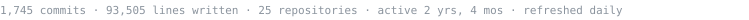

<picture>
  <source media="(prefers-color-scheme: dark)" srcset="./banner-dark.svg" />
  <source media="(prefers-color-scheme: light)" srcset="./banner-light.svg" />
  
</picture>

I lead the AI pod at **RoomMaster** (InnQuest Software, a Valsoft portfolio company), where I
own an agentic support system handling customer tickets across web chat, phone, and email,
and the roadmap for what the product does with AI next. Alongside that I ship full-stack
features on the RoomMaster PMS itself — React and TypeScript on the front, NestJS and
MariaDB stored procedures on the back.

Before this I was founding AI engineer at an automation startup, moving an enterprise customer
base off brittle RPA and onto multi-agent orchestration across 50+ databases and 100+ users.

### What I've built

**Agentic support system** *(private)* — voice, chat, and email agents for RoomMaster Cloud
over a shared tool layer: RAG-grounded answers with citations, intent classification, ticket
creation and smart escalation to live agents, and a safety layer — prompt-injection
detection, PCI/PII redaction, a deterministic grounding gate backed by an LLM hallucination
judge — held honest by a golden-set eval harness. Assistant and tool configuration lives as
code and syncs to production through GitHub Actions. Real telephony, real ticketing, real
escalation paths. Claude on AWS Bedrock · FastAPI · Qdrant · Zendesk · VAPI.

**RoomMaster 26** *(private)* — a ground-up rewrite of a 25-year-old, 1.25M-line Clarion
desktop PMS into a multi-tenant web SaaS that runs against the same database as the legacy
app, so every change must hold exact functional parity with the legacy system. My ground:
the reports subsystem (~35 reports ported to web-native runners with column-level
parity against the desktop app), dashboard KPIs (occupancy, ADR, RevPAR), night-audit
correctness, and the tenant migration pipeline. NestJS · React · MariaDB · AWS.

**[inkris](https://github.com/madatef/inkris)** — a modular AI workspace. Async ingestion to
S3, RAG over mixed file types, web search and scraping, multimodal generation, conversational
memory. FastAPI · React · LangChain · LangSmith · Docker on EC2 behind Nginx.

**[url-shortener](https://github.com/madatef/url-shortener)** — a rebuild of something I wrote
five years ago, done properly: rate limiting, connection pooling, ELK logging, dependency
injection, service/repository separation. A good look at how I structure a backend.

**[flairstechAgent](https://github.com/madatef/flairstechAgent)** — a conversational
support agent that triages issues through natural dialogue and files structured tickets.
The closest public analogue to the production system above: LangChain tool-calling over a
category taxonomy, FastAPI, Supabase, React.

**[Content-evaluator](https://github.com/madatef/Content-evaluator)** — RAG system scoring
marketing assets against brand guidelines via multimodal analysis over SharePoint documents.
Replaced a manual review process.

**[fire-detection](https://github.com/madatef/fire-detection)** — YOLOv8 over live CCTV,
triggering suppression hardware and pushing timestamped alert frames.

### Stack

```
AI systems    LangChain · LangGraph · RAG · vector search · evals · guardrails · OCR
Backend       Python · FastAPI · NestJS · Node · Celery · Redis · SQLAlchemy
Frontend      TypeScript · React · Tailwind · Vite
Data          PostgreSQL · MariaDB · SQL Server · MongoDB · Qdrant · Pinecone · DuckDB
Infra         Docker · AWS (EC2, S3, Bedrock) · GitHub Actions · ELK
```

### Elsewhere

[LinkedIn](https://linkedin.com/in/madatef) · [itsmadatef@gmail.com](mailto:itsmadatef@gmail.com) · Cairo, Egypt

<sub></sub>
